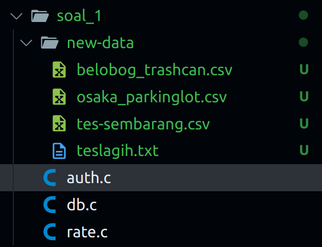
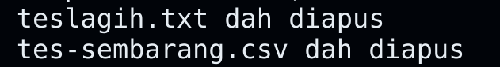
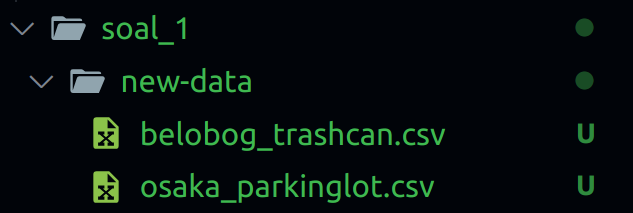
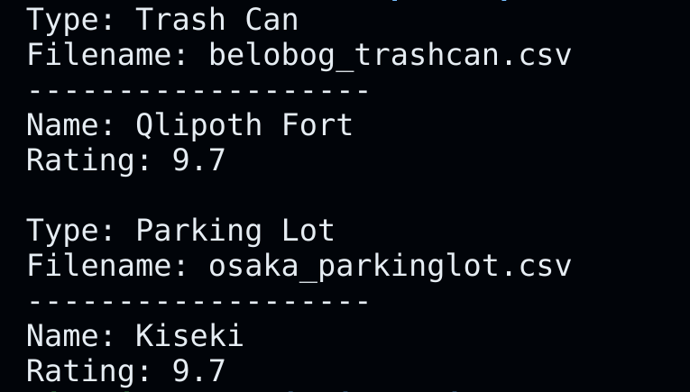
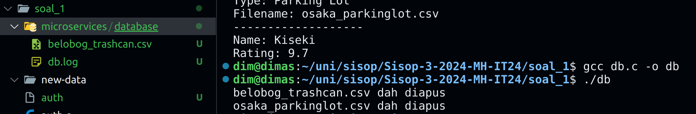
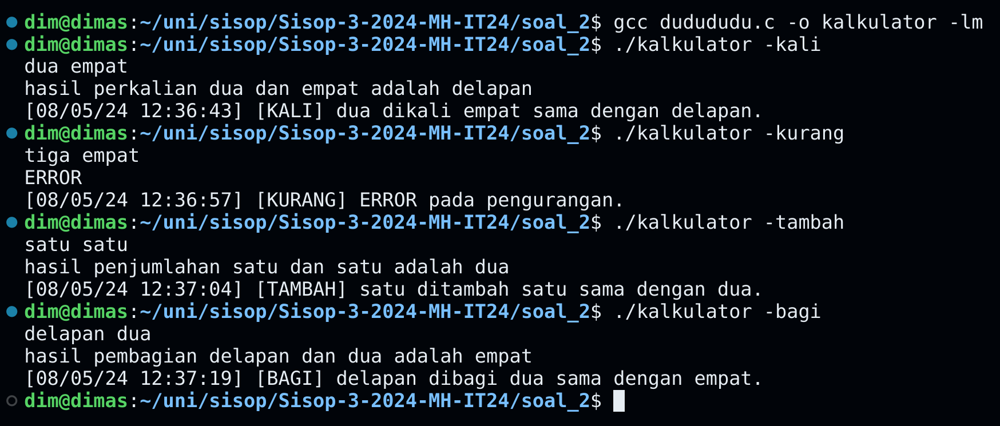
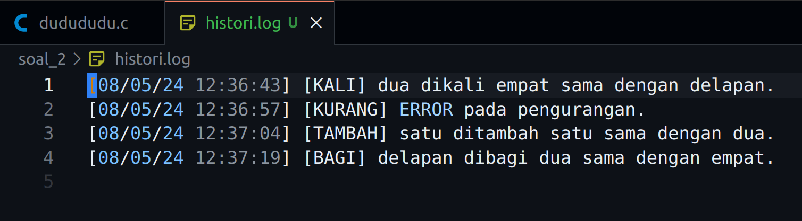
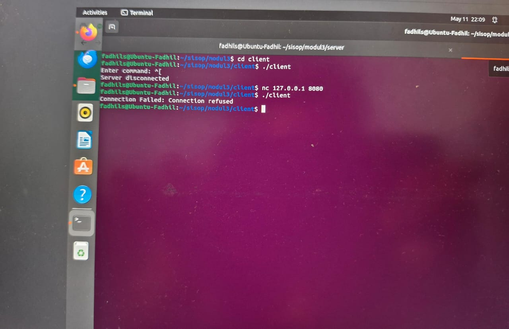
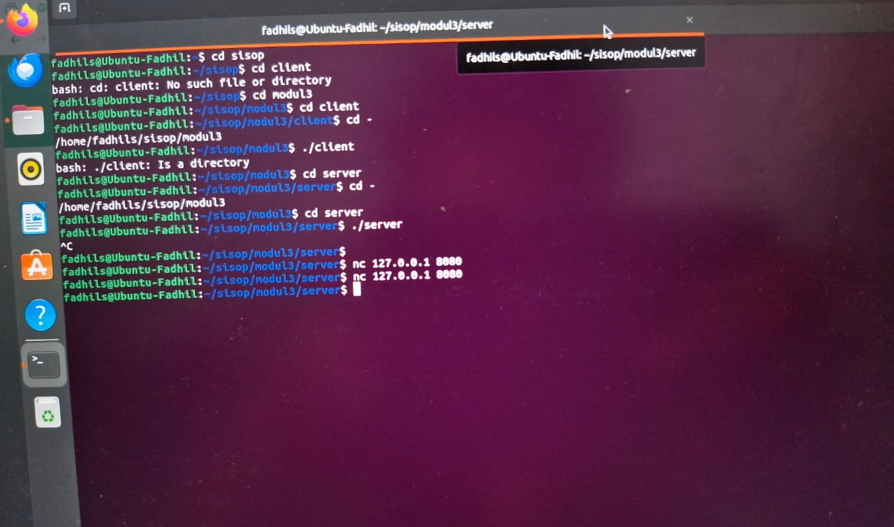

# Sisop Praktikum Modul 3-2024-MH-IT 24

Anggota Kelompok:

- Dimas Andhika Diputra 5027231074
- Mochamad Fadhil Saifullah 5027231068
- Thio Billy Amansyah 5027231007

# Soal 1
Untuk nomor 1 ini ada 3 hal dalam 3 file yang perlu dibuat, pertama ada file `auth.c` untuk verifikasi file yang ada di folder new-data dan jika lolos verif kirim ke shared memory. Kedua ada `rate.c` yang mengambil data dari shared memorynya dan mengambil kesimpulan (rating tertinggi) dari isi file csv. Dan terakhir ada `db.c` yang memindahkan file di new-data ke `microservices/database` lalu membuat log tiap perpindahan file

## auth.c
pertama buat while loop utama yaitu:
```c
while ((de = readdir(dr)) != NULL)
```
kode tersebut melalukan iterasi di folder new-data, lalu kita perlu mengidentifikasi apakah nama filenya mengandung trashcan ataupun parking lot, kalau iya jangan delete, kalau iya delete. Di sini saya pakai flag dimana saya `berasumsi awal` kalau semua file yang ada di `new-data` harus di hapus
```c
char *filename = strdup(de->d_name);
char *token = strtok(filename, "_");
int delete = 1;  // Asumsi awal delete
while (token != NULL) {
    if (strcmp(token, "trashcan") == 0 || strcmp(token, "parkinglot") == 0) {
        delete = 0;  // Jangan delete
        break;
    }
    token = strtok(NULL, "_.");
}
free(filename);
if (delete) {
    char path[1024];
    snprintf(path, sizeof(path), "new-data/%s", de->d_name);
    if (remove(path) == 0)
        printf("%s dah diapus\n", de->d_name);
}
```
dan jika tidak dihapus langsung kirim nama dan isi dari csv ke shared memory. Untuk format filenya sendiri seperti `belobog_trashcan.csv` ataupun `osaka_parkinglot.csv`
```c
if (!delete) {
    char path[1024];
    snprintf(path, sizeof(path), "new-data/%s", de->d_name);

    // Open the file
    FILE *file = fopen(path, "r");
    if (file == NULL) {
        printf("Cannot open file\n");
        return 0;
    }

    // Get the size of the file
    fseek(file, 0, SEEK_END);
    long fsize = ftell(file);
    fseek(file, 0, SEEK_SET);

    // Read the content of the file into a buffer
    char *content = malloc(fsize + 1);
    fread(content, 1, fsize, file);
    fclose(file);
    content[fsize] = 0;
            
    printf("File name: %s\n", de->d_name);
    // Write the filename and the content of the file to the shared memory
    if (curr == 0) {
        sprintf(end, "\n%s\n%s", de->d_name, content);
        end += strlen(de->d_name) + strlen(content) + 2;  // Move the end pointer
    } else {
        sprintf(end, "\n\n%s\n%s", de->d_name, content);
        end += strlen(de->d_name) + strlen(content) + 1;  // Move the end pointer
    }

    printf("Data written in memory: %s\n",str);

    // Free the buffer
    free(content);
}
```

## rate.c
di file ini kita mengambil data dari shared memory dan mengambil kesimpulan rating tertinggi dari tiap file, isi filenya akan seperti:

```
name, rating
Qlipoth Fort, 9.7
Everwinter Hill, 8.7
Rivet Town, 6.0
```

untuk itu, saya pertama lakukan while loop untuk tiap baris dari shared memorynya karena shared memory saya berbentuk seperti:

```
belobog_trashcan.csv
name, rating
Qlipoth Fort, 9.7
Everwinter Hill, 8.7
Rivet Town, 6.0

osaka_parkinglot.csv
name, rating
Dotonbori, 8.6
Kiseki, 9.7
Osaka Castle, 8.5
```

jadi pertama saya buat variabel untuk pengondisian whilenya, ada variabel:
- `res` untuk menyimpan hasil akhir string rating terbaiknya
- `stop` buat indikasi jika di linenya adalah nama file baru, kalau nama file stop = 1
- `curr` untuk indikasi indeks looping karena looping yang saya pakai while loop
- `name` untuk menyimpan name rating tertinggi
- `rating` untuk simpan rating tertinggi

```c
char res[1024] = "";
int stop = 0;
int curr = 0;
char name[50];
float rating = 0;
```

setelah itu saya lakukan looping dan set stop = 0, jika linenya adalah `name, rating` maka saya skip, dan di dalamnya ada 3 kondisi yaitu ketika line mengandung `trashcan`, mengandung `parkinglot`, atau tidak mengandung keduanya yang mana merupakan konten filenya

### Jika line berisi nama file
jika line berisi nama file maka saya langsung simpan string `Type: typenya\nFilename namafile` ke variabel `res`. Lalu saya lakukan pengecekan jika sekarang bukan looping awal maka set stop ke 1, dan append string baru yang berisi seperti berikut ke variabel `res` dan set rating ke 0 lagi:

```
Name: %s\nRating: %.1f\n\n
```
kodenya seperti berikut jika line pada iterasi sekarang berisi nama file:

```c
if (strstr(line, "trashcan") != NULL) {
    if (curr != 0) {
        stop = 1;
        char iTemp[100];
        sprintf(iTemp, "Name: %s\nRating: %.1f\n\n", name, rating);
        strcat(res, iTemp);
        rating = 0;
    }

    char temp[100];
    sprintf(temp, "Type: Trash Can\nFilename: %s\n-------------------\n", line);
    strcat(res, temp);                
} else if (strstr(line, "parkinglot") != NULL) {
    if (curr != 0) {
        stop = 1;
        char iTemp[100];
        sprintf(iTemp, "Name: %s\nRating: %.1f\n\n", name, rating);
        strcat(res, iTemp);
        rating = 0;
    }

    char temp[100];
    sprintf(temp, "Type: Parking Lot\nFilename: %s\n-------------------\n", line);
    strcat(res, temp);
}
```

ini mengambil dari variabel `name` dan `rating` yang mana berarti rating tertinggi untuk tiap file

### Jika line berisi konten
di sini saya ekstrak infonya yang mana jika linenya:

```
Dotonbori, 8.6
```

kodenya seperti berikut jika pada iterasi sekarang linenya berisi konten sebuah file:

```c
else {
    if (!stop) {
        char curName[50];
        float curRating = rating;
        sscanf(line, "%[^,], %f", curName, &curRating);
        if (curRating > rating) {
            rating = curRating;
            strcpy(name, curName);
        }

        // printf("@Name: %s\nRating: %.1f\n", name, rating);
    }
}
```

maka pertama saya bandingkan dengan rating sekarang, jika lebih tinggi variabel `name` dan `rating` akan saya update

> printf name dan rating di akhir program untuk handle file terakhir karena file terakhir tidak akan ketrigger untuk tersimpan ke res, hanya tersimpan ke variabel name dan rating

## db.c
di file db.c pertama saya buat folder microservices dan database terlebih dahulu, saya juga buat file db.lognya

```c
struct stat st = {0};

if (stat("microservices", &st) == -1) {
    mkdir("microservices", 0700);
}

if (stat("microservices/database", &st) == -1) {
    mkdir("microservices/database", 0700);
}

FILE *logFile = fopen("microservices/database/db.log", "a");
```
lalu selanjutnya saya langsung lakukan while loop berdasarkan data yang saya dapatkan dari shared memory sama formatnya seperti sebelumnya. Di sini saya bagi jadi 3 juga, sebelum itu saya buat 1 variabel untuk pengondisiannya yaitu `currName` untuk mengindikasikan pada iterasi sekarang nama file apa yang harus diisi konten

### Jika line isi nama file
jika line isi nama file maka saya langsung buat file di dalam `microservices/database` dan set `currName` menjadi sesuai isi linenya

```c
if (strstr(line, "trashcan") != NULL) {
    char temp[100];
    sprintf(temp, "microservices/database/%s", line);
    FILE *file = fopen(temp, "a");
    currName = line;
    char timestamp[20] = "";
    strftime(timestamp, sizeof(timestamp), "%d/%m/%y %H:%M:%S", localtime(&(time_t){time(NULL)}));
    fprintf(logFile, "[%s] [Trash Can] [%s]\n", timestamp, line);
    fclose(file);
}       
```

lalu saya buat log di `db.log` dan menerapkan hal yang sama jika linenya mengandung `parkinglot`

### Jika line isi konten file
jika sekarang line berisi konten filenya maka saya pertama buka file sesuai variabel `currName` dan append line sekarang ke dalam file

```c
else {
    char path[1024];
    strcpy(path, "microservices/database/");
    strcat(path, currName);
    printf("%s = %s\n", path, line);
    FILE *file = fopen(path, "a");
    if (file != NULL) {
        fprintf(file, "%s\n", line);
        fclose(file);
    } else {
        printf("Failed to open file: %s\n", path);
    } 
}
```

### akhir program
jika loop sudah selesai terakhir saya hapus semua file yang ada di folder `new-data`

```c
struct dirent *de;
DIR *dr = opendir("new-data");
if (dr == NULL) {
    printf("Gabisa dibuka ngab");
    return 0;
}

while ((de = readdir(dr)) != NULL) {
    char path[1024];
    snprintf(path, sizeof(path), "new-data/%s", de->d_name);
    if (remove(path) == 0) printf("%s dah diapus\n", de->d_name);
}
```

## Kendala yang dialami
bentuk data seperti apa yang akan saya simpan ke shared memory, awalnya saya kira harus kirim berbentuk file. Tapi akhirnya saya kirim nama file dan kontennya ke shared memory

## Screenshots
### Hasil dari auth.c




### Hasil dari rate.c


### Hasil dari db.c


# Soal 2
untuk soal ini saya kita perlu menambahkan 2 angka tetapi inputnya kata-kata. Jadi pertama-tama saya langsung buat 2 pipe yaitu `fd1` dan `fd2`. `fd1` digunakan untuk pertukaran data dari parent ke child, sementara `fd2` untuk pertukaran data dari child ke parent

```c
int fd1[2], fd2[2];
    pid_t p;

if (pipe(fd1) == -1) {
    fprintf(stderr, "Pipe 1 Failed");
    return 1;
}

if (pipe(fd2) == -1) {
    fprintf(stderr, "Pipe 2 Failed");
    return 1;
}
```

lalu program juga menerima argv, pada soal argumen yang tersedia hanya `-kali`, `-bagi`, `-tambah`, dan `-kurang`, dan menerima 2 angka input dalam format kata-kata bahasa indonesia

```c
if (argc < 2) {
    printf("harus ada argumennya banh, bisa -kali, -tambah, -kurang, -bagi\n");
    return 1;
}

if (strcmp(argv[1], "-kali") != 0 && strcmp(argv[1], "-tambah") != 0 && strcmp(argv[1], "-kurang") != 0 && strcmp(argv[1], "-bagi") != 0) {
    printf("Salah argumen. Use -kali, -tambah, -kurang, or -bagi.\n");
    return 1;
}

char angka1[50];
char angka2[50];
scanf("%s %s", angka1, angka2);

p = fork();

if (p < 0) {
    fprintf(stderr, "Fork Failed");
    return 1;
}
```

## Fungsi bantuan
maka dari itu saya buat fungsi translate kata2 angka dalam bahasa indonesia ke angka. Untungnya constraint angkanya hanya dari 1 hingga 9 jadi saya hanya buat if else saja

> translate indo to num
```c
int translateIndoToNum(char *word) {
    if (strcmp(word, "satu") == 0) {
        return 1;
    } else if (strcmp(word, "dua") == 0) {
        return 2;
    } else if (strcmp(word, "tiga") == 0) {
        return 3;
    } else if (strcmp(word, "empat") == 0) {
        return 4;
    } else if (strcmp(word, "lima") == 0) {
        return 5;
    } else if (strcmp(word, "enam") == 0) {
        return 6;
    } else if (strcmp(word, "tujuh") == 0) {
        return 7;
    } else if (strcmp(word, "delapan") == 0) {
        return 8;
    } else if (strcmp(word, "sembilan") == 0) {
        return 9;
    } else {
        return -1;
    }
}
```

pada process parent kita perlu translate ke angka, lalu melakukan operasinya, karena itu saya juga buat fungsi bantuan untuk menghandle operasinya

> function itung
```c
int itung(int num1, int num2, char *operation) {
    double result;
    if (strcmp(operation, "-kali") == 0) {
        result = num1 * num2;
    } else if (strcmp(operation, "-tambah") == 0) {
        result = num1 + num2;
    } else if (strcmp(operation, "-kurang") == 0) {
        result = num1 - num2;
    } else if (strcmp(operation, "-bagi") == 0) {
        result = (double)num1 / num2;
    } else {
        printf("salah argumen. Use -kali, -tambah, -kurang, or -bagi.\n");
        return -1;
    }
    return (int)floor(result);
}
```

dan terakhir karena menurut soal kita tidak boleh langsung translate balik ke bahasa indonesia, kita perlu translate hasilnya di child process, saya juga membuat fungsi bantuan untuk itu karena angkanya bisa besar, dan juga bisa 0

> translate angka ke indo fungsi
```c
char* translateNumToIndo(int num) {
    static char result[30];
    char* satuan[] = {"nol", "satu", "dua", "tiga", "empat", "lima", "enam", "tujuh", "delapan", "sembilan"};
    char* belasan[] = {"sebelas", "dua belas", "tiga belas", "empat belas", "lima belas", "enam belas", "tujuh belas", "delapan belas", "sembilan belas"};
    char* puluhan[] = {"sepuluh", "dua puluh", "tiga puluh", "empat puluh", "lima puluh", "enam puluh", "tujuh puluh", "delapan puluh", "sembilan puluh"};

    if (num < 10) {
        strcpy(result, satuan[num]);
    } else if (num < 20) {
        strcpy(result, belasan[num - 11]);
    } else {
        strcpy(result, puluhan[num / 10 - 1]);
        if (num % 10 != 0) {
            strcat(result, " ");
            strcat(result, satuan[num % 10]);
        }
    }

    return result;
}
```

## Parent Process
pada parent process ada 2 hal yang terjadi yaitu kirim data ke child dan menerima data ke child. Keseluruhan program alurnya seperti ini:

> Parent olah data kirim ke child -> Child dapat data dari parent diolah, ditampilkan lalu kirim ke parent isi log -> Parent dapet data log lalu disimpan ke histori.log

pertama parent kirim data ke child. Pada parent saya translate kata2 menjadi angka, dapatkan hasil angka, jika minus saya printf error dan saya set res menjadi -1 saja

```c
close(fd1[0]);
int rilAngka1 = translateIndoToNum(angka1);
int rilAngka2 = translateIndoToNum(angka2);
int res = itung(rilAngka1, rilAngka2, argv[1]);

if (res < 0) {
    printf("ERROR\n");
    res = -1;
}

write(fd1[1], &res, sizeof(res));
close(fd1[1]);

wait(NULL);
```

setelah itu pada parent process juga ada proses terima data dari child, di situ saya langsung append baris baru di `histori.log`  

```c
// Mulai dapet dari child
close(fd2[1]);

char isiLog[100];
read(fd2[0], &isiLog, sizeof(isiLog));
printf("%s\n", isiLog);
FILE *file = fopen("histori.log", "a");
if (file == NULL) {
    printf("Error opening file!\n");
    return 1;
}

fprintf(file, "%s\n", isiLog);

fclose(file);
close(fd2[0]);
```

## Child Process
pada process child ada 2 kali proses juga mirip dengan parent. Pertama child terima data dari parent dan yang kedua child kirim data log ke parent.<br> * Untuk yang pertama child hanya proses angka untuk ditranslate ke kata-kata kemudian ditampilkan

```c
close(fd1[1]);
int res;
read(fd1[0], &res, sizeof(res));
        
if (res != -1) {
    char *operation;
    if (strcmp(argv[1], "-kali") == 0) {
        operation = "perkalian";
    } else if (strcmp(argv[1], "-tambah") == 0) {
        operation = "penjumlahan";
    } else if (strcmp(argv[1], "-kurang") == 0) {
        operation = "pengurangan";
    } else if (strcmp(argv[1], "-bagi") == 0) {
        operation = "pembagian";
    } else {
        printf("salah argumen. Use -kali, -tambah, -kurang, or -bagi.\n");
        return 1;
    }

    char* hasil = translateNumToIndo(res);
    printf("hasil %s %s dan %s adalah %s\n", operation, angka1, angka2, hasil);
} 

close(fd1[0]);
```

Untuk proses yang kedua juga sama, yaitu hanya mengolah data yang ada agar bisa diformat menjadi isi log yang nantinya bisa dikirimkan ke parent

```c
close(fd2[0]);

char timestamp[20] = "";
strftime(timestamp, sizeof(timestamp), "%d/%m/%y %H:%M:%S", localtime(&(time_t){time(NULL)}));
char data[200] = "";
if (strcmp(argv[1], "-kurang") == 0) {
    if (res < 0) {
        sprintf(data, "[%s] [KURANG] ERROR pada pengurangan.", timestamp);
    } else {
        char* hasil = translateNumToIndo(res);
        sprintf(data, "[%s] [KURANG] %s kurang %s sama dengan %s.", timestamp, angka1, angka2, hasil);
    }
} else if (strcmp(argv[1], "-tambah") == 0) {
    char* hasil = translateNumToIndo(res);
    sprintf(data, "[%s] [TAMBAH] %s ditambah %s sama dengan %s.", timestamp, angka1, angka2, hasil);
} else if (strcmp(argv[1], "-kali") == 0) {
    char* hasil = translateNumToIndo(res);
    sprintf(data, "[%s] [KALI] %s dikali %s sama dengan %s.", timestamp, angka1, angka2, hasil);
} else if (strcmp(argv[1], "-bagi") == 0) {
    char* hasil = translateNumToIndo(res);
    sprintf(data, "[%s] [BAGI] %s dibagi %s sama dengan %s.", timestamp, angka1, angka2, hasil);
}

write(fd2[1], data, strlen(data) + 1);

close(fd2[1]);
exit(0);
```

## Kendala yang dialami
cara menggunakan pipes, awalnya saya gatau caranya, ternyata ngikutin modul saja sudah cukup bisa untuk implementasi nomor 2 ini

## Screenshots

hasil histori.log:


# Soal 3 - Driver & Paddock
*Thio BIlly - 5027231007*

Project about client-server interaction using socket programming. 

```
 ./
├── client
│   ├── driver
│   └── driver.c
└── server
    ├── actions.c
    ├── paddock
    ├── paddock.c
    └── race.log

3 directories, 6 files
```
*Fig. 1 Overview of tree files from this project*


*Fig. 2 Process of socket interface between client and server*


## Part 1: driver

Binary file that act as client, where it sends an input to the server and waits until it got a response back. After each response, it will close the connection and make a new one, ready to take another input. Most, if not all, interaction is about asking `paddock` what to do based-off information given from message sent to server. Something along the lines of *"Fuel 10%. What do?"* and replied with *"Refuel. Now"*

## Part 2: paddock
Another binary file that act as server. It listens to its own port for any upcoming request from client. Upon receiving a request, it will run one functions from `actions.c` depending on what the request is about. Kind of like the example at end of part 1. The server will run on daemon mode since start and on loop, waiting for client while not having any.

## Part 3: actions.c
Local library for `paddock.c`. Full of custom functions that will process all client's request and some more. The type of requests are: gap status, fuel status, tire status, and tire type. Other that dealing with requests, this library provide a way to run the server on the backgorund, aka. on daemon. Also it put logs onto race.log, which brings us to..

## Part 4: race.log
All recordings of client-server interactions. All write is from `paddock` binary using `actions.c` library. The log format are as follow: 

``[Driver] [07/04/2024 08:34:50]: Fuel 55``

Actor, dates, and its message.

# Soal 4
3\. client.c

Yang pertama saya membuat constraint untuk menentukan alamat server dan port serta ukuran buffer untuk menyimpan pesan.

```c
#define SERVER\_ADDRESS "127.0.0.1"

#define PORT 8080

#define MAX\_BUFFER\_SIZE 1024
```

Kemudian untuk main function saya menggunakan  int sock = 0; untuk Mendeklarasikan variabel **sock** untuk menampung file descriptor soket. **struct sockaddr\_in serv\_addr;**: Mendeklarasikan struktur **sockaddr\_in** untuk menyimpan alamat server dan **char buffer[MAX\_BUFFER\_SIZE] = {0};**: Mendeklarasikan buffer untuk menyimpan pesan.

```c
int main() {

int sock = 0;

struct sockaddr\_in serv\_addr;

char buffer[MAX\_BUFFER\_SIZE] = {0};
```

Kemudian membuat socket.

```c
`    `if ((sock = socket(AF\_INET, SOCK\_STREAM, 0)) < 0) {

`        `perror("Socket creation error");

`        `exit(EXIT\_FAILURE);

`    `}
```

Langkah selanjutnya Mengatur alamat server dalam struktur **sockaddr\_in**. **AF\_INET**  untuk menunjukkan domain soket untuk IPv4. **htons()** digunakan untuk mengubah urutan byte dari host menjadi urutan byte dari jaringan.

```
`    `serv\_addr.sin\_family = AF\_INET;

`    `serv\_addr.sin\_port = htons(PORT);
```

kemudian saya menggunakan **sockaddr\_in** merubah alamat IP server dari string menjadi format biner.

```
`    `if (inet\_pton(AF\_INET, "127.0.0.1", &serv\_addr.sin\_addr) <= 0) {

`        `perror("Invalid address/ Address not supported");

`        `exit(EXIT\_FAILURE);

`    `}
```

Selanjutnya menggunakan fungsi connect agar bisa terhubung ke server.

```
`    `if (connect(sock, (struct sockaddr \*)&serv\_addr, sizeof(serv\_addr)) < 0) {

`        `perror("Connection Failed");

`        `exit(EXIT\_FAILURE);

`    `}
```

Kemudian membuat kode agar program bisa menerima dan menerima pesan serta fungsi **exit** untuk keluar dari program.

```
`    `char input[MAX\_BUFFER\_SIZE];

`    `while (1) {

`        `printf("Enter command: ");

`        `fgets(input, MAX\_BUFFER\_SIZE, stdin);

`        `send(sock, input, strlen(input), 0);


`        `if (strncmp(input, "exit", 4) == 0) {

`            `printf("Exiting...\n");

`            `break;

`        `}


`        `memset(buffer, 0, sizeof(buffer));

`        `if (recv(sock, buffer, sizeof(buffer), 0) <= 0) {

`            `printf("Server disconnected\n");

`            `break;

`        `}

`        `printf("%s\n", buffer);

`    `}
```

Kemudian tutup socket.

```
close(sock);

`    `return 0;

}
```


server.c

Yang pertama saya membuat constraint untuk menentukan alamat server dan port serta ukuran buffer untuk menyimpan pesan serta ukuran untuk judul, genre, status anime dan panjang maksimum panjang anime.

```c
#define SERVER\_ADDRESS "127.0.0.1"

#define PORT 8080

#define MAX\_COMMAND\_LENGTH 100

#define MAX\_BUFFER\_SIZE 1024

#define MAX\_TITLE\_LENGTH 100

#define MAX\_GENRE\_LENGTH 50

#define MAX\_DAY\_LENGTH 20

#define MAX\_STATUS\_LENGTH 20

#define MAX\_LINE\_LENGTH 255
```

Kemudian membuat fungsi untuk mencatat semua perubahan di change.log.

```c
void log\_change(const char \*type, const char \*message) {

`    `time\_t now;

`    `struct tm \*local\_time;

`    `char time\_str[20];

`    `time(&now);

`    `local\_time = localtime(&now);

`    `strftime(time\_str, sizeof(time\_str), "%d/%m/%y", local\_time);

`    `FILE \*fp = fopen("change.log", "a");

`    `if (fp != NULL) {

`        `fprintf(fp, "[%s] [%s] %s\n", time\_str, type, message);

`        `fclose(fp);

`    `}
```

Kemudian membuat fungsi untuk mengirim pesan di soket.

```
void send\_response(int client\_socket, const char \*response) {

`    `send(client\_socket, response, strlen(response), 0);

}
```

Kemudian membuat fungsi untuk membaca file CSV dan menyimpan dalam bentuk string.

```
void read\_csv\_file(char \*filename, char \*result) {

`    `FILE \*file = fopen(filename, "r");

`    `if (file == NULL) {

`        `perror("Error opening file");

`        `exit(EXIT\_FAILURE);

`    `}

`    `char line[MAX\_LINE\_LENGTH];

`    `while (fgets(line, sizeof(line), file)) {

`        `strcat(result, line);

`    `}

`    `fclose(file);

}
```

Membuat fungsi untuk menampilkan judul, genre, hari tayang dan status tayang.

```c
void handle\_show\_all(int client\_socket) {

`    `char result[MAX\_BUFFER\_SIZE] = {0};

`    `read\_csv\_file("myanimelist.csv", result);

`    `send\_response(client\_socket, result);

}

void handle\_show\_genre(char \*genre, int client\_socket) {

`    `char result[MAX\_BUFFER\_SIZE] = {0};

`    `FILE \*file = fopen("myanimelist.csv", "r");

`    `if (file == NULL) {

`        `perror("Error opening file");

`        `exit(EXIT\_FAILURE);

`    `}

`    `char line[MAX\_LINE\_LENGTH];

`    `while (fgets(line, sizeof(line), file)) {

`        `if (strstr(line, genre) != NULL) {

`            `strcat(result, line);

`        `}

`    `}

`    `fclose(file);

`    `send\_response(client\_socket, result);

}

void handle\_show\_day(char \*day, int client\_socket) {

`    `char result[MAX\_BUFFER\_SIZE] = {0};

`    `FILE \*file = fopen("myanimelist.csv", "r");

`    `if (file == NULL) {

`        `perror("Error opening file");

`        `exit(EXIT\_FAILURE);

`    `}

`    `char line[MAX\_LINE\_LENGTH];

`    `while (fgets(line, sizeof(line), file)) {

`        `if (strstr(line, day) != NULL) {

`            `strcat(result, line);

`        `}

`    `}

`    `fclose(file);

`    `send\_response(client\_socket, result);

}

void handle\_show\_status(char \*title, int client\_socket) {

`    `char result[MAX\_BUFFER\_SIZE] = {0};

`    `FILE \*file = fopen("myanimelist.csv", "r");

`    `if (file == NULL) {

`        `perror("Error opening file");

`        `exit(EXIT\_FAILURE);

`    `}

`    `char line[MAX\_LINE\_LENGTH];

`    `while (fgets(line, sizeof(line), file)) {

`        `char \*token = strtok(line, ",");

`        `if (strcmp(token, title) == 0) {

`            `token = strtok(NULL, ",");

`            `strcat(result, token);

`            `break;

`        `}

`    `}

`    `fclose(file);

`    `send\_response(client\_socket, result);

}
```

Kemudian menambahkan fungsi agar bisa menambahkan anime, mengedit isi file dan menghapus anime yang ada pada file CSV.

```c
void handle\_add\_anime(char \*anime\_info, int client\_socket) {

`    `FILE \*file = fopen("myanimelist.csv", "a");

`    `if (file == NULL) {

`        `perror("Error opening file");

`        `exit(EXIT\_FAILURE);

`    `}

`    `fputs(anime\_info, file);

`    `fclose(file);

`    `send\_response(client\_socket, "Anime added successfully.");

`    `log\_change("ADD", "Anime added.");

}

void handle\_edit\_anime(char \*anime\_info, int client\_socket) {

`    `char temp\_file[] = "temp.csv";

`    `FILE \*file = fopen("myanimelist.csv", "r");

`    `FILE \*temp = fopen(temp\_file, "w");

`    `if (file == NULL || temp == NULL) {

`        `perror("Error opening file");

`        `exit(EXIT\_FAILURE);

`    `}

`    `char line[MAX\_LINE\_LENGTH];

`    `while (fgets(line, sizeof(line), file)) {

`        `char \*token = strtok(line, ",");

`        `if (strcmp(token, anime\_info) == 0) {

`            `fputs(anime\_info, temp);

`        `} else {

`            `fputs(line, temp);

`        `}

`    `}

`    `fclose(file);

`    `fclose(temp);

`    `remove("myanimelist.csv");

`    `rename(temp\_file, "myanimelist.csv");

`    `send\_response(client\_socket, "Anime edited successfully.");

`    `log\_change("EDIT", "Anime edited.");

}

void handle\_delete\_anime(char \*title, int client\_socket) {

`    `char temp\_file[] = "temp.csv";

`    `FILE \*file = fopen("myanimelist.csv", "r");

`    `FILE \*temp = fopen(temp\_file, "w");

`    `if (file == NULL || temp == NULL) {

`        `perror("Error opening file");

`        `exit(EXIT\_FAILURE);

`    `}

`    `char line[MAX\_LINE\_LENGTH];

`    `while (fgets(line, sizeof(line), file)) {

`        `char \*token = strtok(line, ",");

`        `if (strcmp(token, title) != 0) {

`            `fputs(line, temp);

`        `}

`    `}

`    `fclose(file);

`    `fclose(temp);

`    `remove("myanimelist.csv");

`    `rename(temp\_file, "myanimelist.csv");

`    `send\_response(client\_socket, "Anime deleted successfully.");

`    `log\_change("DEL", "Anime deleted.");

}
```

Menambahkan fungsi untuk menentukan tindakan sesuai keinginan pengguna.

```c
void handle\_command(char \*command, int client\_socket) {

`    `char response[MAX\_BUFFER\_SIZE] = {0};

`    `if (strncmp(command, "SHOW ALL", 8) == 0) {

`        `handle\_show\_all(client\_socket);

`    `} else if (strncmp(command, "SHOW GENRE", 10) == 0) {

`        `char \*genre = strtok(command, " ");

`        `genre = strtok(NULL, " ");

`        `handle\_show\_genre(genre, client\_socket);

`    `} else if (strncmp(command, "SHOW DAY", 8) == 0) {

`        `char \*day = strtok(command, " ");

`        `day = strtok(NULL, " ");

`        `handle\_show\_day(day, client\_socket);

`    `} else if (strncmp(command, "SHOW STATUS", 11) == 0) {

`        `char \*title = strtok(command, " ");

`        `title = strtok(NULL, " ");

`        `handle\_show\_status(title, client\_socket);

`    `} else if (strncmp(command, "ADD", 3) == 0) {

`        `char \*anime\_info = strtok(command, " ");

`        `anime\_info = strtok(NULL, "\n");

`        `handle\_add\_anime(anime\_info, client\_socket);

`    `} else if (strncmp(command, "EDIT", 4) == 0) {

`        `char \*anime\_info = strtok(command, " ");

`        `anime\_info = strtok(NULL, "\n");

`        `handle\_edit\_anime(anime\_info, client\_socket);

`    `} else if (strncmp(command, "DELETE", 6) == 0) {

`        `char \*title = strtok(command, " ");

`        `title = strtok(NULL, "\n");

`        `handle\_delete\_anime(title, client\_socket);

`    `} else if (strncmp(command, "exit", 4) == 0) {

`        `snprintf(response, sizeof(response), "Exiting program...");

`        `send\_response(client\_socket, response);

`    `} else {

`        `snprintf(response, sizeof(response), "Invalid Command");

`        `send\_response(client\_socket, response);

`    `}

}
```

Kemudian membuat main function

## Screenshots
Hasil output server:

Hasil output client:
